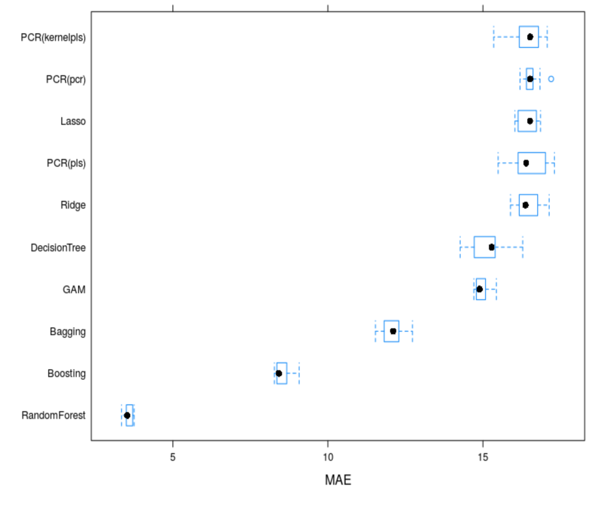
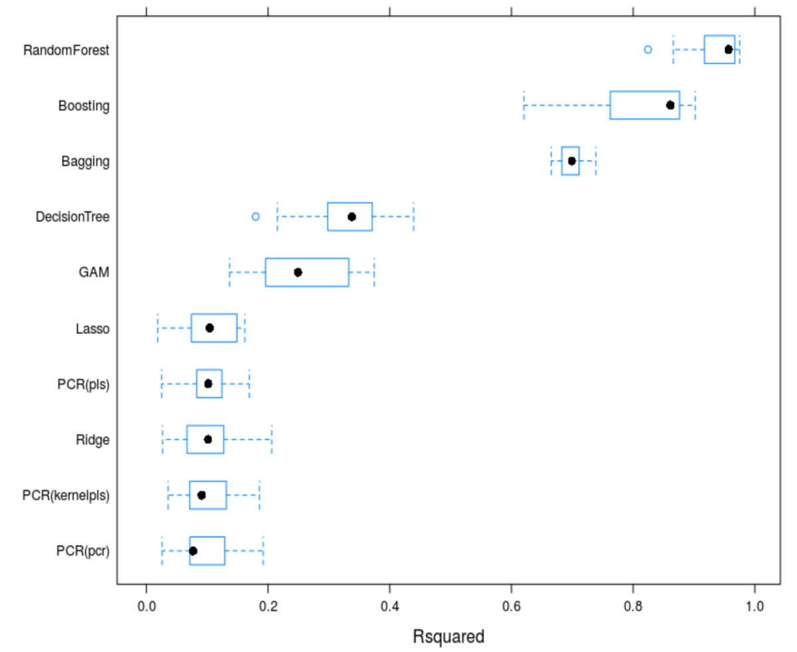
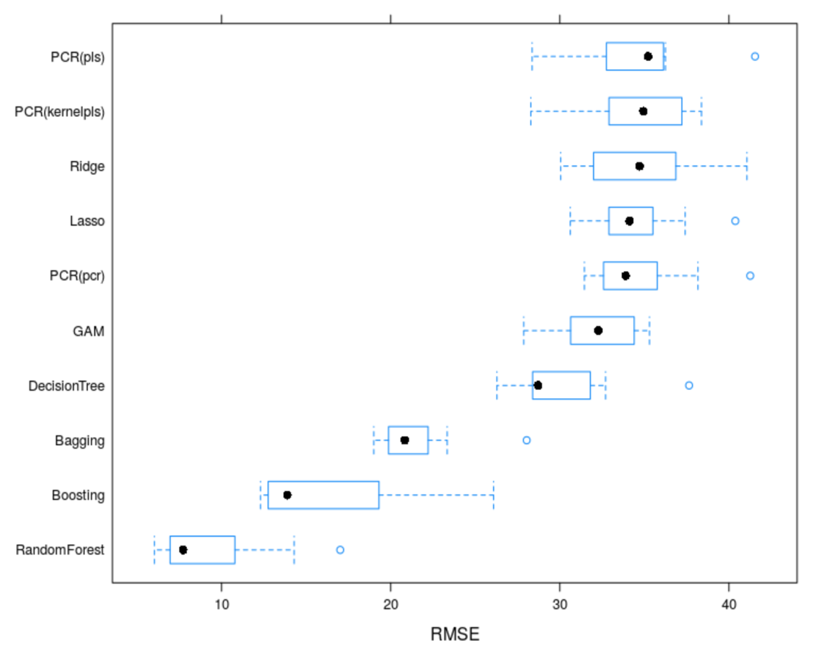

# Table of Contents
1. [Problem](README.md#problem)
1. [Input Dataset](README.md#input-dataset)
1. [Output](README.md#output)
1. [Approach](README.md#Approach)
1. [Testing](README.md#Testing)
1. [Logging](README.md#Logging)
1. [Run_Instructions](README.md#Run_Instructions)
1. [Questions?](README.md#questions?).

## Problem
Flight delays often cause inconvenience for the Airlines, Airports and Passengers. The goal of this project is to predict the delays a flight might face.

## Goals
1. Build a predictive model to predict flight delays(in minutes) at take-off.
2. Achieve accuracy of >70% without overfitting the models.
3. Ensure model is scalable on higher data volume.

## Input Data
The data is provided by US Department of Transportation and hosted by Kaggle. Data contains information on the number of on-time, delayed, canceled, and diverted flights for year 2015.
https://www.kaggle.com/usdot/flight-delays#flights.csv

## Hypothesis
**Hypothesis:**
My strategy for modelling involved understanding the data before diving into the modelling. As flight delay requires predicting values rather than classes I decided to make a Regression model. 

**Null Hypothesis:** 
There exists no relationship between a flight departure delay and summary information on the number of different flights, airport and airlines.

**Alternate Hypothesis:**
There exists a relationship between a flight departure delay and summary information on the number of different flights, airport and airlines.

## Methodology
I built an end-to-end pipeline to generate a predictive model using following steps:

**1. Data Exploration:** 
In this step I explored the data by looking into shape of data, checking for missing values, getting information about each column(feature). This step also uses visualization techniques to explore patterns in arrival delays, departure delays, delays by airlines. This step helped us to identify outliers, categorical values,
and outliers.

**2. Data Preparation:** 
In this step I performed data cleaning before moving to model building.
I got rid of features where most values (82%) are null and features that are
redundant in dataset. After this I performed feature engineering where I are assigning a
region for origin and destination airports. I have then converted some of the columns to data
time format. Finally, I omitted the values from columns that are null *(~2%)*

**3. Exploratory Analysis:** 
In this step I have explored the cleaned data using visualization techniques. 
I identified patterns in data, looked for the outliers, checked the distribution of
data with scatter plots, checked for correlation between different features. I also got rid of
some additional features which were not relevant to for creating the model.

**4. Model Building:** 
In this step I have built the predictive model using linear and non-linear regressors. 
- *Linear regressor* - Linear Regression with Ridge
and Lasso, GAM, and PCR algorithms
- *Non-Linear Regression* - Used KNN, Decision Tree, Random Forest, Bagging and Boosting.

**5. Model Evaluation:** For model evaluation I took into consideration following
parameters - RMSE, MSE and R-squared values. I also checked the residuals of each
model. The goal was to attain high R-square value. After calculating the parameters for all the models, I compared the results of all the models to identify the best model among all.


## Main Findings

1. For some of the columns - `AIR_SYSTEM_DELAY, SECURITY_DELAY, AIRLINE_DELAY,
LATE_AIRCRAFT_DELAY, WEATHER_DELAY, DIVERTED, CANCELLED,
CANCELLATION REASON`, ```81.75%``` of the values were missing from the dataset.
2. There are 322 airports in 54 states with total 14 airlines operating between them.
3. There are 31 variables out of which 5 are categorical, remaining are in number.
4. Aircraft Arrival delay is highly correlated with the Departure Delay.
5. I found that Southwest Airlines has maximum number of flight 10460 and Virginia
Airlines has minimum number of flight 524.
6. I observed that `Frontier Airline` has maximum chance of departure `delay 22.2 minute`
and `Hawaiian Airline` generally `depart before time`.
7. I found `high positive correlation` between 
    ```
    - Departure time & Arrival time, 
    - scheduled arrival & Arrival time, 
    - Departure time & Scheduled Arrival,
    - Departure delay & arrival delay

8. Correlating “scheduled departure & departure delay” I see most of the departure delay are under 50 minutes.
9. In Data exploration, I found that `Taxi in, Wheel in, Taxi out, Wheel out, and Air time` are irrelevant features in finding Departure Delay.
10. Overall `Random-forest` had the best performance amongst all models.


## Model Evaluation

**Mean Absolute error**



**R-squared error**



**Root mean squared error**



**Conclusions -**

- I found that `KNN and Random forest` are giving the `best R2 and RMSE value`. 
- `R2 value in KNN` is `>0.92`, there is chances of `overfitting`. That is why I decided to go with a robust model "Random Forest".


## Recommendations
I have recommendation around feature if someone plans to extend this project for better performance such as:
- Taking holidays into account as this increase the rush.
- Taking day of week into account as weekend and early week are busy.
- Taking time of day into account as mornings and evenings are usually busy.
- Weather condition can be added as additional features to the dataset, this is
	   available with NOAA (National Oceanic and Atmospheric Administration)
